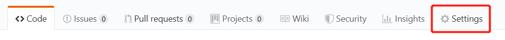
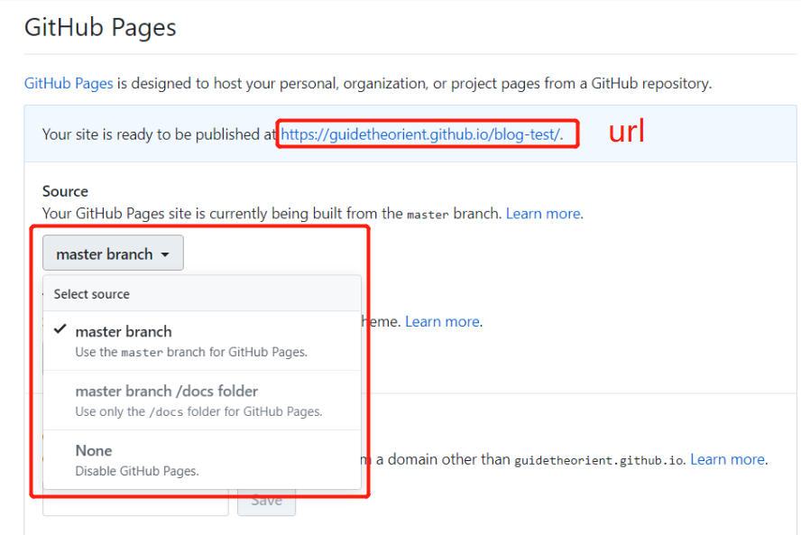

1. 准备好 html 文件并 push 到远程仓库

2. 点击 settings

3. 向下滚动，找到 Github Pages，选择 master branch，即可为 master 分支开启预览。

4. 点击上图中的url，会显示 index.html 文件。若想访问其他 html 文件，则在 url 后面添加对应文件名，如 [https://guidetheorient.github.io/blog-test/test.html](https://guidetheorient.github.io/blog-test/test.html)，即可预览。

